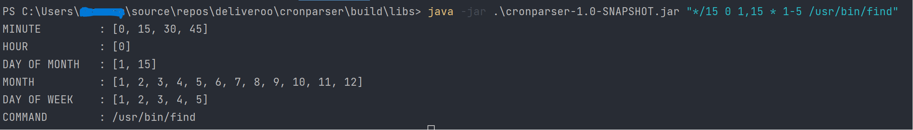

# Cron Expression Parser

- This is a Java-based project for parsing and working with cron expressions. 
- Cron expressions are commonly used to schedule tasks or events to run at specific times and intervals.

## Features

- Expand cron expressions into lists of valid values.
- Supports the standard cron expression format with five fields: minute, hour, day of month, month, and day of week.
- Followed, at the end by a command.
- Tokens are separated by SPACE character.
- Example
  - ```*/15 0 1,15 * 1-5 ls```


| Fields       | Allowed Special Characters | 
|--------------|:--------------------------:|
| Minute       |            *,/-            | 
| Hour         |            *,/-            |
| Day of Month |           *,/-?            |
| Month        |            *,/-            |
| Day Of Week  |           *,/-?            |

## Getting Started

## Prerequisites

- Java 17 or higher.
- Gradle

### Installation

### Getting Codebase

  ```bash
  git clone "repository_url"
  ```

OR

- Download code from drive and unzip

### Installing Java 17

- OS X
  ```bash
  brew install openjdk@17
  ```
- Linux
  ```bash
  sudo apt-get update
  sudo apt-get install openjdk-17-jdk
  ```

### Installing gradle

- OS X
  ```bash
    brew install gradle
  ```
- Linux
  ```bash
  sudo apt-get update
  sudo apt-get install gradle
  ```

### Building Jar

- Move to the project root & run following command
- OS X / Linux
  ```bash
  ./gradlew jar
  ```
- You can locate the generated JAR file in the "build/libs" directory. It will have a name like "
  your-project-name-version.jar".

### Running Jar

Open in the directory where the jar file is present.

  ```bash
      "java -jar {jarName}.jar "cron_expression"
  ```

```bash
   "java -jar cronparser-1.0-SNAPSHOT.jar "*/15 0 1,15 * 1-5 /usr/bin/find"
  ```

Required Field : argument (cron_expression), else exception will be thrown.

### Examples

1. Parsing correct cron expression

```bash
   "java -jar cronparser-1.0-SNAPSHOT.jar "*/15 0 1,15 * 1-5 /usr/bin/find"
  ```

Output



2. Parsing incorrect expression with missing field.

```bash
   "java -jar cronparser-1.0-SNAPSHOT.jar "**"
  ```

Output


